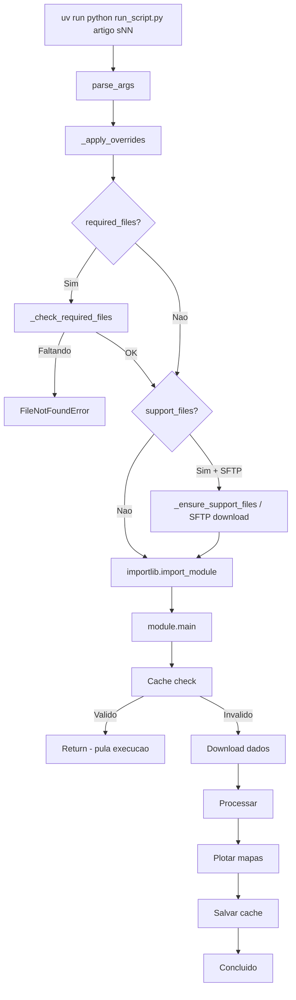

# Guia: Adicionando Novos Scripts

Como adicionar um novo script meteorologico ao projeto `campos_e_graficos_artigos_cientificos`.

---

## Visao geral

Cada artigo cientifico tem sua propria pasta em `artigos/` (ex: `artigos/artigo_JBN_AS_17_07_2026/`), com seus proprios scripts. Cada script segue um padrao:

1. Baixa dados de uma fonte (ERA5/CDS, SFTP, etc.)
2. Processa os dados (medias, anomalias, etc.)
3. Gera mapas/graficos por area geografica
4. Salva resultados em `Saida/<artigo>/`

O CLI (`run_script.py`) descobre e executa scripts a partir do dicionario `SCRIPTS` em `app/cli/run_script.py` (estrutura `{artigo: {script_key: {...}}}`). Para adicionar um novo, crie a pasta do artigo (se ainda nao existir), crie o script e registre-o.

---

## Passo a passo

### 1. Escolher artigo e identificador

Se o artigo ainda nao tem pasta, crie `artigos/<nome_do_artigo>/__init__.py` (vazio).

O identificador do script segue o padrao `sNN` (sequencial, reinicia em cada artigo):

| Artigo | Existente | Descricao |
|--------|-----------|-----------|
| `artigo_JBN_AS_17_07_2026` | `s00` | *(proximo disponivel)* |

**Convencao de nomes:**

```
Artigo:           artigo_JBN_AS_17_07_2026
Identificador:    s00
Arquivo:          artigos/artigo_JBN_AS_17_07_2026/s00_precipitacao_era5.py
Flag:             RUN_S00
Diretorio saida:  Saida/artigo_JBN_AS_17_07_2026/s00_PRECIPITACAO/
Logger:           get_logger("s00")
Cache:            "artigo_JBN_AS_17_07_2026_s00"  (prefixado pelo artigo, evita colisao entre artigos)
```

### 2. Criar o script

Crie o arquivo `artigos/<artigo>/sNN_descricao.py` com a seguinte estrutura:

```python
"""sNN: Descricao breve do que o script faz."""

import time
from datetime import datetime
from pathlib import Path

import matplotlib.pyplot as plt
import numpy as np
import xarray as xr

from app.common.cache_manager import check_cache_valid, save_cache_metadata
from app.shared.logger import get_logger
from app.shared.settings_factory import settings

logger = get_logger("sNN")


def main():
    """Entry point - chamado pelo CLI sem argumentos."""
    start_time = time.time()

    logger.info("=" * 80)
    logger.info("SCRIPT sNN: DESCRICAO")
    logger.info("=" * 80)

    # 1. Configurar saida
    output_dir = Path(settings.DIR_OUTPUT) / "sNN_DESCRICAO"
    output_dir.mkdir(parents=True, exist_ok=True)

    lst_areas = ["brasil", "nordeste"]

    # 2. Verificar cache (evita reprocessamento)
    cache_params = {
        "DATA_INICIAL": settings.DATA_INICIAL,
        "DATA_FINAL": settings.DATA_FINAL,
        "areas": lst_areas,
        "script_version": "1.0",
    }
    output_files = [str(output_dir / f"sNN_{area}.png") for area in lst_areas]

    if check_cache_valid("sNN", cache_params, output_files):
        logger.info("CACHE VALIDO - pulando execucao")
        return

    # 3. Parse de datas do settings
    dt_ini = datetime.strptime(settings.DATA_INICIAL, "%Y-%m-%d")
    dt_fim = datetime.strptime(settings.DATA_FINAL, "%Y-%m-%d")

    # 4. Download de dados
    # from app.src.uteis.downloaders_variavel_ERA5 import ensure_variavel_for_period
    # files = ensure_variavel_for_period(start=dt_ini, end=dt_fim, ...)

    # 5. Processamento
    # ds = xr.open_dataset(...)

    # 6. Plotagem por area
    for area in lst_areas:
        area_cfg = settings["areas_plotagem"][area]
        # fig = plt.figure(figsize=(15, 10))
        # ax = fig.add_subplot(1, 1, 1, projection=ccrs.PlateCarree())
        # ... contourf, colorbar, gridlines ...
        # plt.savefig(output_dir / f"sNN_{area}.png", dpi=150, bbox_inches="tight")
        # plt.close(fig)
        pass

    # 7. Salvar cache
    execution_time = time.time() - start_time
    save_cache_metadata("sNN", cache_params, output_files, execution_time)
    logger.info(f"Script sNN concluido em {execution_time:.1f}s")
```

> **Importante:** A funcao DEVE se chamar `main()` sem parametros. O CLI chama `module.main()` via `importlib`.

### 3. Baixar dados (ERA5/GDAS ja tem downloader generico — use antes de criar um novo)

Para ERA5 (Copernicus CDS) ou GDAS (NOMADS), **nao crie um downloader por variavel** — use os
genericos que ja existem em `app/src/uteis/`, parametrizados por variavel/nivel/periodo:

**Se o periodo pedido pode chegar perto de hoje**, use `ensure_observado_for_period` — ele tenta
o ERA5 (reanalise) primeiro e completa com GDAS (analise, quase em tempo real) SO o trecho que o
CDS confirmar que ainda nao tem, usando a data real informada pelo proprio CDS (nao um numero
fixo de dias — a latencia do ERA5 varia):

```python
from datetime import datetime
from app.src.uteis.downloaders_era5_gdas_generico import ensure_observado_for_period

arquivos = ensure_observado_for_period(
    artigo="<artigo>", variavel="geopotencial", nivel=500, start=dt_ini, end=dt_fim,
)
```

Se o periodo e sempre historico (nunca chega perto de hoje), pode usar so o `ensure_era5_for_period`
diretamente (mais simples, um download so, sem a tentativa/fallback):

```python
from app.src.uteis.downloaders_era5_generico import ensure_era5_for_period
from app.src.uteis.downloaders_gdas_generico import ensure_gdas_for_period

arquivos_era5 = ensure_era5_for_period(
    artigo="<artigo>", variavel="geopotencial", nivel=500, start=dt_ini, end=dt_fim,
)
# ou so GDAS, mesma assinatura, se so precisar do periodo recente:
arquivos_gdas = ensure_gdas_for_period(
    artigo="<artigo>", variavel="geopotencial", nivel=500, start=dt_ini, end=dt_fim,
)
```

O parametro `artigo` (mesmo nome da pasta em `artigos/`) organiza o download em
`dados/<artigo>/ERA5_<variavel>[_<nivel>hPa]/` e `dados/<artigo>/GDAS_<variavel>[_<nivel>hPa]/` —
nao precisa criar a pasta `dados/<artigo>/` na mao, o CLI ja garante que ela existe (espelha
`artigos/` automaticamente toda vez que voce roda `run_script.py`).

As variaveis disponiveis (e suas unidades/niveis) ficam em `app/src/uteis/variaveis_meteorologicas.py`
(`VARIAVEIS`). **Se a variavel que voce precisa nao estiver la, adicione uma entrada nova** —
e um dicionario controlado (nome CDS + nome/nivel GDAS por chave amigavel), nao aceita nomes
crus da API, entao toda variavel nova passa por esse cadastro. Veja o docstring de
`VariavelSpec` no proprio arquivo para o significado de cada campo.

Se o script baixa dados de outra fonte (nao ERA5/GDAS), crie um modulo dedicado em:

```
app/src/uteis/downloaders_<variavel>_<fonte>.py
```

Convencao de nome da funcao principal: `ensure_<fonte>_<variavel>_for_period(...)`.

Padrao:
- Salve arquivos em `dados/<subdiretorio>/` (NAO em `Entrada/` — este e para arquivos fixos)
- Aceite parametro `force_redownload` para forcar re-download

### 4. Criar processador (se precisar processar dados brutos)

Se precisa transformar os dados brutos antes de plotar:

```
app/src/uteis/processa_<variavel>.py
```

Exemplo de uso tipico: concatenar arquivos mensais baixados e calcular a media diaria.

### 5. Registrar no CLI

Edite `_build_scripts_dict()` em `app/cli/run_script.py` e adicione ao artigo correspondente (crie a chave do artigo se for o primeiro script dele):

```python
def _build_scripts_dict() -> dict:
    return {
        "artigo_JBN_AS_17_07_2026": {
            # Novo script:
            "sNN": {
                "module": "artigos.artigo_JBN_AS_17_07_2026.sNN_descricao",
                "description": "Descricao curta (max ~40 chars)",
                "setting_flag": "RUN_SNN",
                "support_files": [],
                "required_files": [],
            },
        },
        # "outro_artigo": { ... },
    }
```

`list_scripts()` (`--list`) e o menu de comandos sao gerados automaticamente a partir desse dicionario — nao precisa editar mais nada em `app/cli/run_script.py` alem dele.

#### Tipos de arquivos de dependencia

O projeto diferencia dois tipos de arquivos que um script pode precisar:

**`support_files`** — Arquivos que podem ser baixados via SFTP do servidor Oracle:

```python
"support_files": [
    {
        "local": "Entrada/arquivos_nc/climatologia.nc",
        "remote": "/home/ubuntu/resources/meteorologia/campos-observados/climatologia/climatologia.nc",
        "description": "Climatologia 1991-2020",
    },
],
```

- Quando `SFTP_ENABLED=true` (development): baixa automaticamente antes de executar
- Quando `SFTP_ENABLED=false` (production): avisa mas nao bloqueia

**`required_files`** — Arquivos que devem existir localmente (sem SFTP):

```python
"required_files": [
    {
        "local": "Entrada/legenda.png",
        "description": "Legenda do mapa",
    },
],
```

- Se nao existir, levanta `FileNotFoundError` com mensagem clara
- Use para arquivos que nao estao no servidor remoto

### 6. Adicionar flag no settings

Edite `app/settings/settings.toml` na secao `[default]`:

```toml
[default]
# ... flags existentes ...
RUN_S00 = true
RUN_S01 = true
RUN_SNN = true    # <-- novo
```

Edite `settings.local.example.toml`:

```toml
# Flags: descomente para desativar scripts no --all
# RUN_S00 = false
# RUN_S01 = false
# RUN_SNN = false    # <-- novo
```

### 7. Atualizar documentacao

Adicione no `CHANGELOG.md`:

```markdown
## [Unreleased]

### Adicionado
- Script artigo_JBN_AS_17_07_2026/sNN: descricao do que faz
```

---

## Resumo de arquivos

| Acao   | Arquivo | Obrigatorio? |
|--------|---------|:------------:|
| Criar  | `artigos/<artigo>/__init__.py` | Se for o primeiro script do artigo |
| Criar  | `artigos/<artigo>/sNN_descricao.py` | Sim |
| Criar  | `app/src/uteis/downloaders_*.py` | Se usa API |
| Criar  | `app/src/uteis/processa_*.py` | Se processa |
| Editar | `app/cli/run_script.py` — `_build_scripts_dict()` | Sim |
| Editar | `app/settings/settings.toml` — RUN_SNN | Sim |
| Editar | `settings.local.example.toml` | Sim |
| Editar | `CHANGELOG.md` | Sim |

---

## Diagrama de fluxo



---

## Fluxo de configuracoes (prioridade)


Arquivos a direita tem **maior prioridade** e sobrescrevem os da esquerda.

---

## Imports padrao

```python
# Infra do projeto (use SEMPRE estes, nao os antigos)
from app.shared.logger import get_logger
from app.shared.settings_factory import settings
from app.common.cache_manager import check_cache_valid, save_cache_metadata

# Cartografia (se gera mapas)
import cartopy.crs as ccrs
import cartopy.feature as cfeature
import matplotlib.pyplot as plt

# Dados
import numpy as np
import xarray as xr
```

> **Nao use** `from app.config import settings` nem `from app.common.logger import ...` — estes sao legados.

---

## Tratamento de erros

O projeto usa um **handler global de excecoes** no entry point do CLI (`@friendly_errors` em `app/cli/run_script.py`). Isso significa que voce **nao precisa colocar try/except** em cada pedaco de codigo.

### Como funciona

Toda excecao nao tratada em Python sobe automaticamente ate o topo da pilha de chamadas. O decorator `@friendly_errors` fica no `main()` e intercepta tudo ali, traduzindo erros tecnicos em mensagens amigaveis com solucao.

```
Seu script (nivel 3)  ──┐
  Downloader (nivel 2)  ─┤  excecao sobe automaticamente
    Paramiko (nivel 1)  ──┘
                          ▼
    @friendly_errors     ← intercepta e mostra mensagem amigavel
```

Em vez de um traceback de 50 linhas, o usuario ve:

```
ERRO: Arquivo nao encontrado no servidor SFTP

Solucao:
  Verifique se o caminho remoto esta correto
  ou copie o arquivo manualmente.

Dica: use --verbose para ver o traceback completo
```

### O que fazer no seu script

| Situacao | O que fazer |
|----------|-------------|
| Erro generico (IO, rede, parse) | Deixe subir. O handler trata. |
| Precisa adicionar contexto | `raise RuntimeError("mensagem clara") from None` |
| Erro recuperavel (retry, fallback) | `try/except` local e OK |
| Validacao de entrada | `raise ValueError("mensagem clara")` |

**Errado** — engole o erro:

```python
try:
    ds = xr.open_dataset("arquivo.nc")
except Exception as e:
    print(f"Erro: {e}")  # handler global nunca ve o erro
    return
```

**Certo** — deixa subir:

```python
ds = xr.open_dataset("arquivo.nc")  # se falhar, o handler trata
```

**Aceitavel** — adiciona contexto e re-lanca:

```python
try:
    ds = xr.open_dataset(path)
except OSError:
    raise RuntimeError(f"Falha ao abrir climatologia: {path}") from None
```

### Adicionando erros conhecidos ao seu script

Se o seu script pode gerar um erro especifico que merece uma dica amigavel, adicione uma entrada no mapa `_ERROR_HINTS` em `app/shared/error_handler.py`:

```python
(
    Exception,       # tipo da excecao
    "503",           # substring na mensagem (ou None)
    "API indisponivel. Tente novamente em alguns minutos.",
),
```

Erros ja mapeados: SFTP, SSH, CDS API, NetCDF corrompido, imports faltando. Veja a lista completa em `app/shared/error_handler.py`.

---

## Dicas

- **Cache**: Inclua `script_version` nos `cache_params`. Incremente quando mudar a logica de plotagem para forcar reprocessamento.
- **Areas**: Use `settings["areas_plotagem"]` para configuracoes geograficas. As areas ja estao definidas no `settings.toml` (brasil, nordeste, atlantico_tropical, etc.).
- **Dados baixados**: Downloads do CDS vao para `dados/`, NAO para `Entrada/`.
- **Teste rapido**: Use `--data-inicial` e `--data-final` com periodo curto (1-2 dias) para testar sem baixar muitos dados.
- **ERA5**: Os dados tem ~5 dias de atraso. Use `DATA_FINAL` de pelo menos 5 dias atras.
