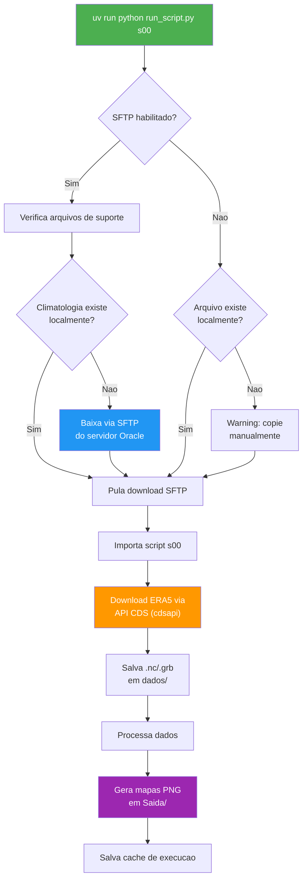
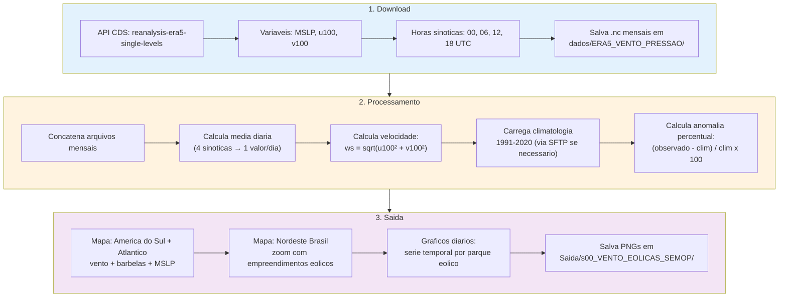
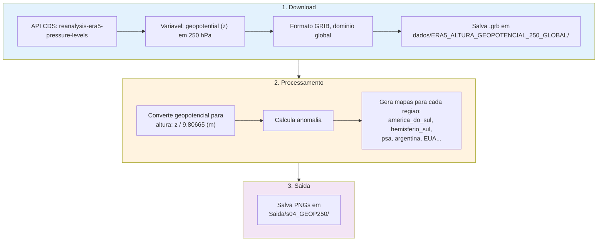
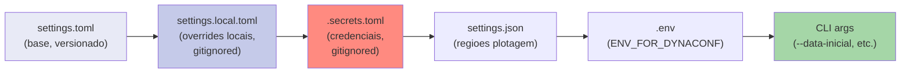
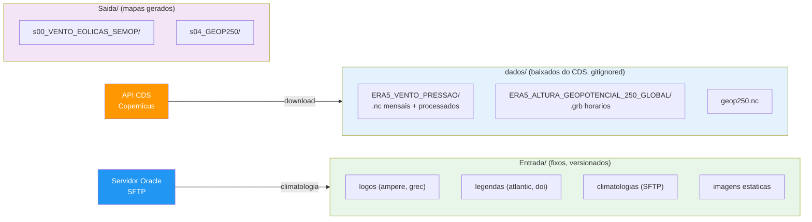

# Campos Observados ERA5

Download e plotagem de campos meteorologicos observados a partir da reanalise ERA5 (Copernicus CDS).


---

## Visao Geral

Este projeto automatiza o download de dados de reanalise ERA5 do Copernicus Climate Data Store (CDS) e gera mapas meteorologicos. Foi projetado para que **meteorologistas** criem seus scripts na pasta `scripts/` de forma simples, enquanto toda a infraestrutura (download, cache, logging, SFTP) e gerenciada pelo framework.

**O que o projeto faz:**
1. Baixa dados ERA5 (vento 100m, pressao, geopotencial) via API do CDS
2. Processa os dados (media diaria, anomalias vs climatologia)
3. Gera mapas PNG para diversas regioes geograficas
4. Opcionalmente, busca arquivos de suporte (climatologias) de um servidor remoto via SFTP

---

## Arquitetura

```
campos_observados_era5/
├── run_script.py                 # Entry point (wrapper)
├── setup.sh                      # Setup automatizado
├── pyproject.toml                # Dependencias (UV)
├── .python-version               # Python 3.12.9
├── .env.example                  # Template ENV_FOR_DYNACONF
├── settings.local.example.toml   # Template config local
│
├── scripts/                      # Scripts do meteorologista
│   ├── s00_plotagem_vento_eraa5.py   # Vento 100m + MSLP
│   └── s01_geop250_anom.py           # Anomalia geopotencial 250hPa
│
├── app/
│   ├── cli/
│   │   └── run_script.py         # CLI (argparse + dicionario SCRIPTS)
│   ├── shared/                   # Infraestrutura reutilizavel
│   │   ├── singleton.py          # Metaclass Singleton
│   │   ├── settings_factory.py   # Dynaconf factory
│   │   ├── logger.py             # LoggerService (Loguru)
│   │   └── sftp_client.py        # Cliente SFTP (Paramiko)
│   ├── settings/
│   │   ├── settings.toml         # Config base (ambientes)
│   │   ├── settings.json         # Regioes de plotagem
│   │   ├── .secrets.toml         # Credenciais (gitignored)
│   │   └── .secrets_example.toml # Template credenciais
│   ├── common/                   # Utilitarios (cache, download, etc.)
│   └── src/uteis/                # Downloaders e processadores ERA5
│
├── Entrada/                      # Arquivos fixos (logos, legendas, climatologias)
├── dados/                        # Dados baixados do CDS (.nc, .grb) — gitignored
├── Saida/                        # Mapas gerados (.png)
└── logs/                         # Logs da aplicacao
```

---

## Fluxo Geral de Execucao



---

## Fluxo do Script s00 — Vento 100m + MSLP

O script `s00` baixa dados ERA5 de vento a 100 metros e pressao ao nivel do mar, calcula anomalias em relacao a climatologia 1991-2020 e gera mapas para areas pre-definidas.



**Arquivos gerados:**
- `Saida/s00_VENTO_EOLICAS_SEMOP/vento_SEMOP_america_do_sul_atlantico.png`
- `Saida/s00_VENTO_EOLICAS_SEMOP/vento_SEMOP_nordeste_brasil.png`
- `Saida/s00_VENTO_EOLICAS_SEMOP/graficos_diarios/vento_diario_*.png`

**Arquivo de suporte (baixado via SFTP):**
- `Entrada/arquivos_nc/climatologia_1991_2020_vento100m_ERA5.nc`

---

## Fluxo do Script s01 — Anomalia Geopotencial 250hPa

O script `s01` baixa o campo de geopotencial em 250 hPa (nivel de jato subtropical) e gera mapas de anomalia para diversas regioes.



**Arquivos gerados:**
- `Saida/s04_GEOP250/geop250_america_do_sul.png`
- `Saida/s04_GEOP250/geop250_hemisferio_sul.png`
- `Saida/s04_GEOP250/geop250_psa.png`
- (e outros por regiao)

**Arquivo obrigatorio (local, nao SFTP):**
- `Entrada/legenda_atlantic.png`

---

## Instalacao e Setup

### Pre-requisitos

- **Python 3.12.9** (definido em `.python-version`)
- **UV** (package manager — instalado automaticamente pelo `setup.sh`)
- Conta no [Copernicus CDS](https://cds.climate.copernicus.eu/) com chave de API

### Passo a passo

```bash
# 1. Clone o repositorio
git clone <url-do-repositorio>
cd campos_observados_era5

# 2. Execute o setup automatizado
bash setup.sh
```

O `setup.sh` faz:
- Verifica/instala o UV
- Pergunta qual ambiente instalar (development / production / qa)
- Copia templates de configuracao (`.env`, `settings.local.toml`, `.secrets.toml`)
- Copia `.vscode/settings_exemplo.json` para `.vscode/settings.json` (automatico)
- Cria diretorios (`Entrada/`, `dados/`, `Saida/`, `logs/`)
- Instala dependencias com `uv sync`

### Configurar credenciais

Apos o setup, preencha sua chave do CDS:

```bash
# Edite o arquivo de secrets
nano app/settings/.secrets.toml
```

```toml
[default]
KEY_CDS = "sua-chave-copernicus-aqui"  # Obtenha em https://cds.climate.copernicus.eu/

[development]
SSH_HOST = "152.67.34.247"
SSH_PORT = 22
SSH_USERNAME = "ubuntu"
SSH_KEY_PATH = "~/.ssh/meteorologia-oracle-sp.pem"
```

### Configurar datas

```bash
nano settings.local.toml
```

```toml
[development]
DATA_INICIAL = "2026-03-01"
DATA_FINAL = "2026-03-12"
```

---

## Uso (CLI)

```bash
# Listar scripts disponiveis e comandos
uv run python run_script.py --list
```

### Executar script especifico

```bash
# s00: Baixa ERA5 (vento 100m + MSLP), gera mapas em Saida/s00_VENTO_EOLICAS_SEMOP/
uv run python run_script.py s00

# s01: Baixa geopotencial 250hPa, gera mapas em Saida/s04_GEOP250/
uv run python run_script.py s01
```

### Opcoes

```bash
# Logging detalhado (DEBUG)
uv run python run_script.py s00 --verbose

# Forcar re-download dos dados (ignora .nc/.grb existentes)
uv run python run_script.py s00 --force-download

# Sobrescrever datas do settings.local.toml
uv run python run_script.py s00 --data-inicial 2026-03-01 --data-final 2026-03-12

# Executar todos os scripts habilitados
uv run python run_script.py --all

# Limpar cache (forca reprocessamento)
uv run python run_script.py --clear-cache
```

### Alternativa: ativar virtualenv

```bash
source .venv/bin/activate
python run_script.py --list
python run_script.py s00
```

---

## Configuracao

### Prioridade de Settings

O Dynaconf carrega configuracoes em cascata. Arquivos posteriores sobrescrevem os anteriores:



### Ambientes

O ambiente ativo e definido por `ENV_FOR_DYNACONF` no `.env`:

| Setting | default | development | qa | production |
|---------|---------|-------------|-----|------------|
| LEVEL_LOGGING | INFO | DEBUG | DEBUG | INFO |
| SFTP_ENABLED | false | **true** | false | false |
| LOGGER_BACKTRACE | false | true | true | false |
| LOGGER_DIAGNOSE | false | true | false | false |

- **development**: Logging verbose, SFTP habilitado (baixa climatologias do servidor Oracle)
- **qa**: Logging verbose, sem SFTP
- **production**: Logging minimo, execucao local no servidor

### Separacao de diretorios: Entrada/ vs dados/



### Arquivos de dependencia dos scripts

O CLI verifica automaticamente dois tipos de arquivos antes de executar cada script:

**Arquivos de suporte (SFTP)** — Podem ser baixados automaticamente do servidor Oracle quando `SFTP_ENABLED=true`:

| Script | Arquivo | Caminho local |
|--------|---------|---------------|
| s00 | Climatologia vento 100m (1991-2020) | `Entrada/arquivos_nc/climatologia_1991_2020_vento100m_ERA5.nc` |

**Arquivos obrigatorios (local)** — Devem existir localmente. Se nao encontrados, o CLI levanta `FileNotFoundError` com instrucoes:

| Script | Arquivo | Caminho local |
|--------|---------|---------------|
| s01 | Legenda mapa Atlantico | `Entrada/legenda_atlantic.png` |

---

## Adicionando Novos Scripts

O meteorologista pode criar novos scripts em `scripts/` seguindo o guia detalhado em [GUIA-NOVOS-SCRIPTS.md](GUIA-NOVOS-SCRIPTS.md).

**Resumo rapido:** criar o script com `main()`, registrar no dicionario `SCRIPTS` em `app/cli/run_script.py`, adicionar flag `RUN_SNN` no `settings.toml` e testar com `--list`.

---

## Troubleshooting

### `ImportError: jinja2 must be installed`

O `settings.toml` usa expressoes `@jinja`. Execute:
```bash
uv sync
```

### `FileNotFoundError: climatologia_1991_2020_vento100m_ERA5.nc`

O arquivo de climatologia nao existe localmente. Opcoes:
1. Configure SFTP em `app/settings/.secrets.toml` e rode novamente (download automatico)
2. Copie manualmente do servidor: `/home/ubuntu/resources/meteorologia/campos-observados/Entrada/arquivos_nc/`

### Datas nao disponiveis no ERA5

O ERA5 tem uma latencia de **~5 dias**. Se voce pedir dados de ontem, o CDS retornara erro. Ajuste `DATA_FINAL` para pelo menos 5 dias atras.

### `poetry shell` nao encontrado

Este projeto usa **UV**, nao Poetry. Use:
```bash
uv run python run_script.py --list
# ou
source .venv/bin/activate
python run_script.py --list
```

### Logs muito verbosos do CDS

O logging do `cdsapi` ja esta configurado para `WARNING`. Se ainda estiver verboso, verifique se `debug=False` nos downloaders em `app/src/uteis/`.

---

## Tratamento de Erros

O CLI usa um **handler global de excecoes** (`@friendly_errors`) que traduz tracebacks em mensagens amigaveis com solucao. Nao precisa de try/except espalhado pelo codigo.

```
ERRO: Arquivo nao encontrado no servidor SFTP

Solucao:
  Verifique se o caminho remoto esta correto
  ou copie o arquivo manualmente.

Dica: use --verbose para ver o traceback completo
```

O mapa de erros conhecidos fica em `app/shared/error_handler.py`. Erros ja cobertos: SFTP, SSH, CDS API, NetCDF corrompido, imports. Para detalhes, veja [GUIA-NOVOS-SCRIPTS.md](GUIA-NOVOS-SCRIPTS.md#tratamento-de-erros).

---

## Dados ERA5

- **Fonte:** [Copernicus Climate Data Store](https://cds.climate.copernicus.eu/)
- **Dataset s00:** `reanalysis-era5-single-levels` (MSLP, u100, v100)
- **Dataset s01:** `reanalysis-era5-pressure-levels` (geopotential 250hPa)
- **Resolucao:** 0.25 x 0.25 graus
- **Horas sinoticas:** 00, 06, 12, 18 UTC
- **Latencia:** ~5 dias
- **Documentacao detalhada:** [docs/era5_single_levels_dataset.md](docs/era5_single_levels_dataset.md)

---

## Tecnologias

| Tecnologia | Uso |
|------------|-----|
| Python 3.12.9 | Linguagem |
| UV | Gerenciador de pacotes |
| Dynaconf | Configuracao (ambientes, TOML) |
| Loguru | Logging (rotacao, compressao) |
| cdsapi | Download ERA5 do Copernicus |
| xarray | Leitura/processamento NetCDF e GRIB |
| cartopy | Projecoes cartograficas para mapas |
| matplotlib | Plotagem |
| scipy | Processamento numerico |
| paramiko | SSH/SFTP para servidor remoto |

---

(c) Ampere Consultoria Ltda
