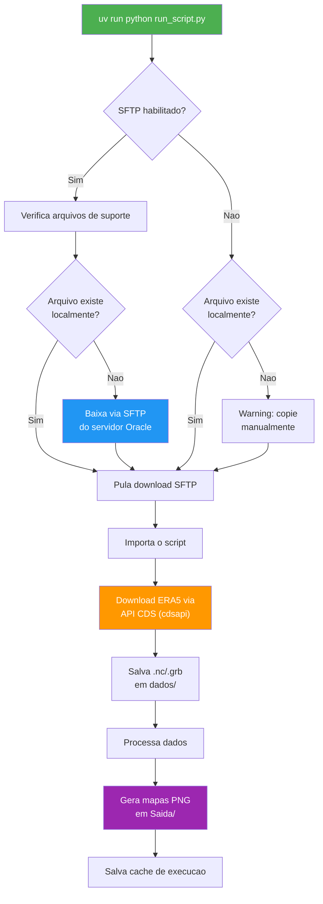
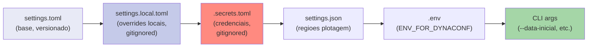
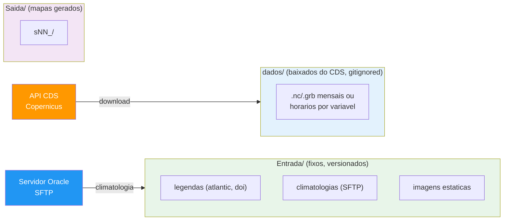

# Campos e Graficos para Artigos Cientificos

Download e plotagem de campos meteorologicos observados a partir da reanalise ERA5 (Copernicus CDS).


---

## Visao Geral

Este projeto automatiza o download de dados de reanalise ERA5 do Copernicus Climate Data Store (CDS) e gera mapas meteorologicos. Foi projetado para que **meteorologistas** criem seus scripts na pasta `scripts/` de forma simples, enquanto toda a infraestrutura (download, cache, logging, SFTP) e gerenciada pelo framework.

**O que o projeto faz:**
1. Baixa dados ERA5 (vento 100m, pressao, geopotencial) via API do CDS
2. Processa os dados (media diaria, anomalias vs climatologia)
3. Gera mapas PNG para diversas regioes geograficas
4. Opcionalmente, busca arquivos de suporte (climatologias) de um servidor remoto via SFTP

---

## Arquitetura

```
campos_e_graficos_artigos_cientificos/
├── run_script.py                 # Entry point (wrapper)
├── setup.sh                      # Setup automatizado
├── pyproject.toml                # Dependencias (UV)
├── .python-version               # Python 3.12.9
├── .env.example                  # Template ENV_FOR_DYNACONF
├── settings.local.example.toml   # Template config local
│
├── scripts/                      # Scripts do meteorologista (vazio — veja GUIA-NOVOS-SCRIPTS.md)
│
├── app/
│   ├── cli/
│   │   └── run_script.py         # CLI (argparse + dicionario SCRIPTS)
│   ├── shared/                   # Infraestrutura reutilizavel
│   │   ├── singleton.py          # Metaclass Singleton
│   │   ├── settings_factory.py   # Dynaconf factory
│   │   ├── logger.py             # LoggerService (Loguru)
│   │   └── sftp_client.py        # Cliente SFTP (Paramiko)
│   ├── settings/
│   │   ├── settings.toml         # Config base (ambientes)
│   │   ├── settings.json         # Regioes de plotagem
│   │   ├── .secrets.toml         # Credenciais (gitignored)
│   │   └── .secrets_example.toml # Template credenciais
│   ├── common/                   # Utilitarios (cache, download, etc.)
│   └── src/uteis/                # Downloaders e processadores ERA5
│
├── Entrada/                      # Arquivos fixos (legendas, climatologias)
├── dados/                        # Dados baixados do CDS (.nc, .grb) — gitignored
├── Saida/                        # Mapas gerados (.png)
└── logs/                         # Logs da aplicacao
```

---

## Fluxo Geral de Execucao



Nenhum script esta registrado no momento — veja [GUIA-NOVOS-SCRIPTS.md](GUIA-NOVOS-SCRIPTS.md) para adicionar o primeiro.

---

## Instalacao e Setup

### Pre-requisitos

- **Python 3.12.9** (definido em `.python-version`)
- **UV** (package manager — instalado automaticamente pelo `setup.sh`)
- Conta no [Copernicus CDS](https://cds.climate.copernicus.eu/) com chave de API

### Passo a passo

```bash
# 1. Clone o repositorio
git clone <url-do-repositorio>
cd campos_e_graficos_artigos_cientificos

# 2. Execute o setup automatizado
bash setup.sh
```

O `setup.sh` faz:
- Verifica/instala o UV
- Pergunta qual ambiente instalar (development / production / qa)
- Copia templates de configuracao (`.env`, `settings.local.toml`, `.secrets.toml`)
- Copia `.vscode/settings_exemplo.json` para `.vscode/settings.json` (automatico)
- Cria diretorios (`Entrada/`, `dados/`, `Saida/`, `logs/`)
- Instala dependencias com `uv sync`

### Configurar credenciais

Apos o setup, preencha sua chave do CDS:

```bash
# Edite o arquivo de secrets
nano app/settings/.secrets.toml
```

```toml
[default]
KEY_CDS = "sua-chave-copernicus-aqui"  # Obtenha em https://cds.climate.copernicus.eu/

[development]
SSH_HOST = "152.67.34.247"
SSH_PORT = 22
SSH_USERNAME = "ubuntu"
SSH_KEY_PATH = "~/.ssh/meteorologia-oracle-sp.pem"
```

### Configurar datas

```bash
nano settings.local.toml
```

```toml
[development]
DATA_INICIAL = "2026-03-01"
DATA_FINAL = "2026-03-12"
```

---

## Uso (CLI)

```bash
# Listar scripts disponiveis e comandos
uv run python run_script.py --list
```

### Executar script especifico

```bash
# Depois de registrar um script (veja GUIA-NOVOS-SCRIPTS.md):
uv run python run_script.py <script>
```

### Opcoes

```bash
# Logging detalhado (DEBUG)
uv run python run_script.py <script> --verbose

# Forcar re-download dos dados (ignora .nc/.grb existentes)
uv run python run_script.py <script> --force-download

# Sobrescrever datas do settings.local.toml
uv run python run_script.py <script> --data-inicial 2026-03-01 --data-final 2026-03-12

# Executar todos os scripts habilitados
uv run python run_script.py --all

# Limpar cache (forca reprocessamento)
uv run python run_script.py --clear-cache
```

### Alternativa: ativar virtualenv

```bash
source .venv/bin/activate
python run_script.py --list
python run_script.py <script>
```

---

## Configuracao

### Prioridade de Settings

O Dynaconf carrega configuracoes em cascata. Arquivos posteriores sobrescrevem os anteriores:



### Ambientes

O ambiente ativo e definido por `ENV_FOR_DYNACONF` no `.env`:

| Setting | default | development | qa | production |
|---------|---------|-------------|-----|------------|
| LEVEL_LOGGING | INFO | DEBUG | DEBUG | INFO |
| SFTP_ENABLED | false | **true** | false | false |
| LOGGER_BACKTRACE | false | true | true | false |
| LOGGER_DIAGNOSE | false | true | false | false |

- **development**: Logging verbose, SFTP habilitado (baixa climatologias do servidor Oracle)
- **qa**: Logging verbose, sem SFTP
- **production**: Logging minimo, execucao local no servidor

### Separacao de diretorios: Entrada/ vs dados/



### Arquivos de dependencia dos scripts

O CLI verifica automaticamente dois tipos de arquivos antes de executar cada script, declarados no dict `SCRIPTS` (`app/cli/run_script.py`):

- **Arquivos de suporte (SFTP)** — Podem ser baixados automaticamente do servidor Oracle quando `SFTP_ENABLED=true`.
- **Arquivos obrigatorios (local)** — Devem existir localmente. Se nao encontrados, o CLI levanta `FileNotFoundError` com instrucoes.

Veja [GUIA-NOVOS-SCRIPTS.md](GUIA-NOVOS-SCRIPTS.md) para como declarar esses arquivos ao registrar um script.

---

## Adicionando Novos Scripts

O meteorologista pode criar novos scripts em `scripts/` seguindo o guia detalhado em [GUIA-NOVOS-SCRIPTS.md](GUIA-NOVOS-SCRIPTS.md).

**Resumo rapido:** criar o script com `main()`, registrar no dicionario `SCRIPTS` em `app/cli/run_script.py`, adicionar flag `RUN_SNN` no `settings.toml` e testar com `--list`.

---

## Troubleshooting

### `ImportError: jinja2 must be installed`

O `settings.toml` usa expressoes `@jinja`. Execute:
```bash
uv sync
```

### `FileNotFoundError: <arquivo>.nc`

Um arquivo de suporte (ex.: climatologia) declarado no script nao existe localmente. Opcoes:
1. Configure SFTP em `app/settings/.secrets.toml` e rode novamente (download automatico)
2. Copie manualmente do servidor: `/home/ubuntu/resources/meteorologia/campos-observados/Entrada/arquivos_nc/`

### Datas nao disponiveis no ERA5

O ERA5 tem uma latencia de **~5 dias**. Se voce pedir dados de ontem, o CDS retornara erro. Ajuste `DATA_FINAL` para pelo menos 5 dias atras.

### `poetry shell` nao encontrado

Este projeto usa **UV**, nao Poetry. Use:
```bash
uv run python run_script.py --list
# ou
source .venv/bin/activate
python run_script.py --list
```

### Faixa branca vertical em 180° nos mapas

**Sintoma:** Uma linha branca vertical aparece no mapa exatamente em 180° de longitude (linha de data), especialmente em mapas do Pacífico (MJO, trópico, hemisfério sul, PSA).

**Causa raiz:** A climatologia de baixa resolução (ex: PSL 2.5°) vai até ~177.5°E, mas os dados ERA5/GDAS têm resolução 0.25° e chegam até 179.75°E. Na interpolação, os pontos entre 177.75° e 179.75°E ficam **fora do range da climatologia**, gerando `NaN`. O `contourf` não preenche células `NaN`, e o fundo branco aparece como faixa.

> ⚠️ **Atenção:** Este bug é fácil de confundir com problema de renderização do cartopy (cyclic point, data transform). Antes de investigar cartopy, verifique se há NaN nos dados.

**Como diagnosticar:**
```python
import xarray as xr, numpy as np
ds = xr.open_dataset('dados/geop250.nc')
da = ds['hgt'].isel(time=0)
lon_near_180 = da.sel(lon=slice(175, 181), method=None)
print('NaN?', np.isnan(lon_near_180.values).any())
print('Colunas com NaN:', lon_near_180.lon.values[np.isnan(lon_near_180.values).any(axis=0)])
```

**Solução:** Adicionar ponto cíclico à climatologia **antes** de interpolar, fechando o gap entre 177.5° e 180°:
```python
from cartopy.util import add_cyclic_point as _acp
clim_vals_cyc, clim_lon_cyc = _acp(clim_da.values, coord=clim_da['lon'].values)
clim_da = xr.DataArray(
    clim_vals_cyc,
    dims=clim_da.dims,
    coords={'lat': clim_da['lat'].values, 'lon': clim_lon_cyc},
)
clim_regrid = clim_da.interp(lat=data.lat, lon=data.lon, method='linear')
```

**Aplica-se a:** qualquer script que interpole climatologia de baixa resolução (PSL, NCEP, etc.) para a grade ERA5/GDAS de 0.25°.

---

### Logs muito verbosos do CDS

O logging do `cdsapi` ja esta configurado para `WARNING`. Se ainda estiver verboso, verifique se `debug=False` nos downloaders em `app/src/uteis/`.

---

## Tratamento de Erros

O CLI usa um **handler global de excecoes** (`@friendly_errors`) que traduz tracebacks em mensagens amigaveis com solucao. Nao precisa de try/except espalhado pelo codigo.

```
ERRO: Arquivo nao encontrado no servidor SFTP

Solucao:
  Verifique se o caminho remoto esta correto
  ou copie o arquivo manualmente.

Dica: use --verbose para ver o traceback completo
```

O mapa de erros conhecidos fica em `app/shared/error_handler.py`. Erros ja cobertos: SFTP, SSH, CDS API, NetCDF corrompido, imports. Para detalhes, veja [GUIA-NOVOS-SCRIPTS.md](GUIA-NOVOS-SCRIPTS.md#tratamento-de-erros).

---

## Dados ERA5

- **Fonte:** [Copernicus Climate Data Store](https://cds.climate.copernicus.eu/)
- **Datasets:** `reanalysis-era5-single-levels` e `reanalysis-era5-pressure-levels`, conforme a variavel
- **Resolucao:** 0.25 x 0.25 graus
- **Horas sinoticas:** 00, 06, 12, 18 UTC
- **Latencia:** ~5 dias
- **Documentacao detalhada:** [docs/era5_single_levels_dataset.md](docs/era5_single_levels_dataset.md)

---

## Tecnologias

| Tecnologia | Uso |
|------------|-----|
| Python 3.12.9 | Linguagem |
| UV | Gerenciador de pacotes |
| Dynaconf | Configuracao (ambientes, TOML) |
| Loguru | Logging (rotacao, compressao) |
| cdsapi | Download ERA5 do Copernicus |
| xarray | Leitura/processamento NetCDF e GRIB |
| cartopy | Projecoes cartograficas para mapas |
| matplotlib | Plotagem |
| scipy | Processamento numerico |
| paramiko | SSH/SFTP para servidor remoto |

---

## Bugs Conhecidos (pendentes)

- **Corrente de jato "congelada" no s43 (setas/texto não se movem) quando a velocidade configurada
  é um número INTEIRO (1.0, 2.0, 3.0...).** Diagnosticado em 2026-07-05, ainda não corrigido —
  **exclusivo do s43** (mapa 2D plano); confirmado que o s42/globo NÃO tem esse problema.
  **Causa raiz real**: em `_jato_flat_overlay` (`globo_3d_anim.py`), `frac = frame_idx * vel` —
  quando `vel` é inteiro, `frac` também é sempre inteiro em todo frame, e a etapa seguinte
  (`_jet_flow_sequence`) usa `(frac * espaçamento) % espaçamento`, que dá exatamente ZERO pra
  qualquer `frac` inteiro (congela). O `_render_clip` do globo (`globo_3d_anim.py`) já EVITA esse
  problema: antes de montar a config de cada jato, multiplica a velocidade configurada por
  `_phase_unit = 1.0 / GLOBO_3D_GE_GIF_FRAMES` (`velocidade': ... * _phase_unit`), garantindo que
  o valor que chega na fórmula nunca seja um inteiro exato. O `_build_jatos_cfg()` do s43
  (`mapa_2d_anim.py`) esqueceu esse passo — usa a velocidade direto da setting, sem multiplicar
  por `_phase_unit`. **Fix**: replicar a mesma normalização (`_phase_unit = 1.0 /
  GLOBO_2D_GIF_FRAMES`, aplicada à velocidade de cada jato) no `_build_jatos_cfg()` do s43 — não
  precisa mexer na função compartilhada nem no s38-s42.
- **Faixas finas translúcidas do jato (`_offset_polyline`) esticam de forma latitude-dependente
  no mapa 2D plano (s43), mesmo bug de fundo do ícone de pressão (já corrigido só pro ícone).**
  `_offset_polyline` compensa o deslocamento por `cos(latitude)` pra ficar "isométrico na esfera"
  — correto pro globo 3D, mas incorreto no PlateCarree (equirretangular, sem essa foreshortening
  esférica). Efeito mais sutil que o do ícone (deslocamentos pequenos, 0.5°–1.7°), mas mesma causa
  raiz. Fix: aplicar a mesma flag `ctx['mapa_plano']` (já usada em `_draw_icones_pressao`) aqui
  também, pulando a divisão por `cos(lat)` quando quem chama é o s43.

---

## Ideias Futuras

Backlog de longo prazo, sem prazo definido — registrado aqui pra retomar a conversa quando fizer
sentido, sem se perder entre os pedidos do dia a dia.

- **Vento animado por partículas (estilo Windy.com) + tudo animado (ícones, jato, câmera voando)
  no mesmo vídeo dos scripts s38-s43.** Discutido em 2026-07-05. Diferença fundamental do
  mecanismo atual: Windy usa milhares de partículas advectadas pelo campo de vento (u,v) frame a
  frame, com rastro que desvanece — diferente de `_jet_segments`/`_offset_polyline`
  (`app/src/uteis/globo_3d_anim.py`), que extraem UMA isolinha-guia e desenham faixas
  estilizadas ao redor dela. Daria pra simular em matplotlib, mas o gargalo real do projeto hoje
  não é conta numérica (numpy vetorizado é rápido) — é o DESENHO por frame em cartopy/matplotlib
  (motivo de já existir cache de fundo + `GLOBO_3D_WORKERS`). Desenhar milhares de partículas como
  artistas individuais pioraria bastante esse gargalo; mitigável renderizando o campo de
  partículas como RASTER (mesmo truque já usado pelo jato: `_jato_raster` + `imshow`) em vez de
  milhares de objetos matplotlib soltos.
  - **Recomendação de arquitetura, se algum dia for adiante**: NÃO reescrever o projeto. O
    pipeline de dados (download ERA5/GFS/GEFS, processamento, cache, settings) é a parte valiosa
    e difícil, e não é o gargalo de performance — continua 100% Python/xarray. Só a CAMADA DE
    RENDERIZAÇÃO (hoje matplotlib, CPU-bound) valeria trocar por algo acelerado por GPU (ex.:
    WebGL/Three.js no navegador, ou uma lib Python com GPU tipo `vispy`/`moderngl`), consumindo os
    mesmos arrays numpy que o pipeline atual já produz.
  - **Hardware do usuário já checado (2026-07-05)**: GPU dedicada AMD Radeon RX 6600 (via
    PowerShell/WMI a partir do WSL2) — placa de nível intermediário, não seria um obstáculo pra
    uma solução baseada em WebGL (roda direto no navegador/Windows, nem precisa passar pelo WSL).

---

(c) Ampere Consultoria Ltda
